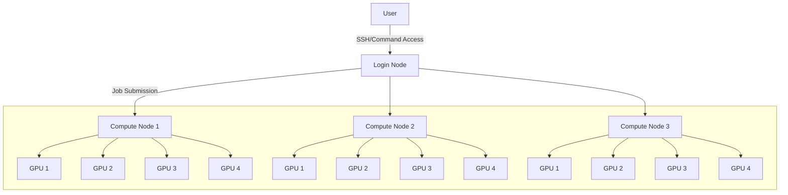
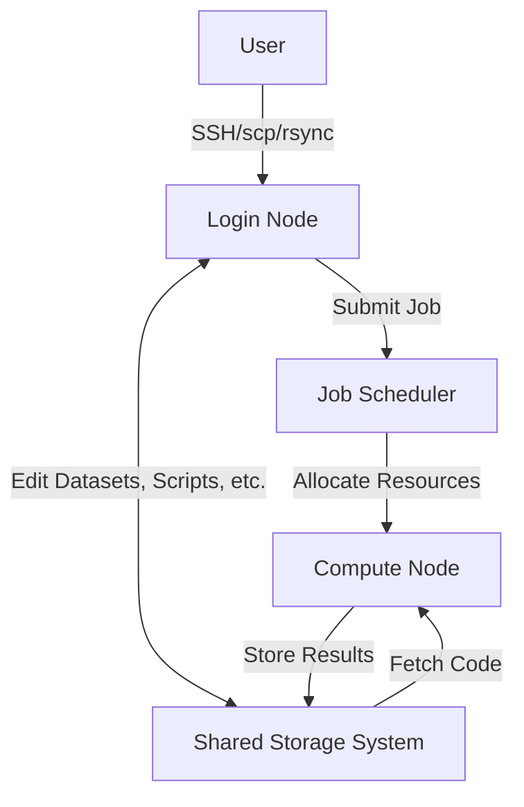

# Working with Clusters for Deep Learning

**Created by [Jona Ruthardt](https://jonaruthardt.github.io/)** (01/2025)

---
<!-- _hide: true -->

!!! note "Before you start ..." 
    This tutorial will get you started using SLURM-based GPU clusters for your deep learning projects. The goal is to guide you through the process of accessing and effectively utilizing a cluster, particularly for people who may be new to cluster computing. 

    By the end of the tutorial, you will understand:

    1. **What a GPU cluster is** and how its components interact
    2. **How to connect to a cluster** and set up your environment
    3. **How to schedule and manage jobs** to access GPUs for your experiment
    4. **Best practices for working with a cluster** to maximize your productivity and the efficiency of your experiments

    While this tutorial was created for courses at [UTN](https://www.utn.de) and therefore provides some instructions specific to the [Alex cluster by FAU](https://doc.nhr.fau.de/clusters/alex/), most aspect translate to other compute and GPU clusters as well. It can still serve you as an helpful resource and introduction to the topic.

--- 

# The Alex Cluster

To work effectively with a compute cluster, it is important to be familiar with its high-level architecture and which components it is comprised of. The following sections provide a basic introduction to the Alex cluster by FAU. For more detailed information, see the [official documentation](https://doc.nhr.fau.de/clusters/alex/). 

## What is a Cluster?

A (GPU) cluster is a collection of interconnected computers (***nodes***), that are equipped with Graphics Processing Units (***GPUs***). These GPUs are specialized hardware accelerators designed for highly parallel computations, making them particularly effective for tasks like deep learning, machine learning, and other computationally intensive applications.

---

### Why Use GPU Clusters?

When scaling up model architectures and the volume of training/evaluation data, computational demands can quickly overwhelm personal computers or local GPUs. In contrast, GPU clusters offer the following advantages: 

- **Scalability** (more available resources → train larger models; run many tasks at once)
- **Efficiency** (higher performance resources → train models faster)
- **Advanced hardware** (access cutting-edge hardware)

**Additional benefit for students:** familiarize yourself with tools and infrastructure used in the industry and gain practical experience

---

### Differences to Local Computing

|  | Local Compute | GPU Cluster |
| --- | --- | --- |
| Hardware | Limited to resources on your personal device | Access to powerful GPUs |
| Performance | Suitable for small-scale tasks | Optimized for large-scale computations |
| Accessibility | Direct interaction with your system | Accessed remotely via network connection |
| Resource Sharing | Dedicated to one user | Shared across multiple users with job scheduling |
| Scalability | Restricted to the one device | Utilize multiple GPUs (and nodes) |

---

## Compute Architecture

On a high level, a cluster can be conceptualized as individual computers (nodes) that are connected to a central entity and can exchange information. Nonetheless, each node has its own CPU, memory, and storage. A cluster is typically made up of at least two types of nodes:

### Login Nodes

The login nodes serve as your way to **access the cluster**. When you connect to the cluster, you are automatically connected to one of these nodes. They provide you with a basic interface to interact with the cluster (e.g., file management, coding, submitting jobs). However, they are not intended for any serious computational workload or running jobs. Since they are shared across multiple users, be mindful and **avoid running resource-intensive processes** on login nodes. 

### Compute Nodes

The compute/GPU nodes are where **computationally demanding tasks** are executed. Connecting directly to a compute node is usually not possible and it is first necessary to reserve the resources by scheduling a ***job*** from a login node.

The scheduler (e.g., SLURM) is responsible for managing and allocating the resources in the cluster. User requests are queued and prioritized based on factors like scheduled runtime, resource requirements, time in queue, etc. Once sufficient resources become available, the appropriate node(s) are allocated and are now usable to run user-specified code. 

The GPU nodes on Alex you have access to have the following specs:

- 2x AMD EPYC CPU (2x 64 cores @2.0 GHz)
- 8x Nvidia A40 GPU (40GB VRAM)
- 512 GB memory
- 7 TB node-local storage

Typically, compute nodes are divided further into smaller compute units. These units represent a subset of the available resources (such as a specific number of CPU cores or GPUs) and are allocated based on user requests. For example, our compute node with 8 GPUs can be partitioned into 8 smaller units (→ 16 CPU cores, 64GB RAM, ~1TB SSD), depending on the task at hand. This partitioning allows multiple users to share the same node without interfering with each other’s work, optimizing resource utilization. 

---



---

## Filesystems and Data Storage

In addition to the storage on the node itself, the cluster has a centralized filesystem that all nodes can access. This allows users to store and manage their data and models. This section will guide you through the cluster’s available filesystems, their intended use, and best practices for managing your data effectively. Understanding these will help you optimize storage, maintain data integrity, and avoid issues such as quota limits or accidental data loss.

---

### Overview

The cluster provides several filesystems, each with specific purposes, storage capacities, and backup policies. Here’s a summary of the most essential ones:

| Environment Variable | Purpose | Backup and Snapshots | IO Speed | Quota |
| --- | --- | --- | --- | --- |
| $HOME | Important and unrecoverable files (e.g., scripts, results) | Yes | Normal | 50 GB |
| $HPCVAULT | Long-term storage of data | Yes (less frequent) | Slow | 500 GB |
| $WORK | General-purpose files (e.g., logs, intermediate results) | No | Normal | 1000 GB |
| $TMPDIR | Job-specific (!) scratch space | No | Very Fast | None |

---

### Accessing Storage

The above file systems (except for the node-local $TMPDIR) are mounted across all cluster nodes. You can easily access the storage directories from anywhere using their predefined environment variables. Here are two examples: 

**Bash**

- Navigate to your $WORK directory: `cd $WORK`
- List all files in your $HPCVAULT directory: `cd $HPCVAULT`

**Python**

```python
import os

# Get the path to your $HOME directory
home_path = os.environ.get("HOME")
print(f"Home directory: {home_path}")
```

---

### Best Practices

- Use $HOME or $HPCVAULT for important files due to backups and snapshots
- Store temporary or large files in $WORK, or $TMPDIR (will be deleted after job finished!).
- Stage your data to node-local $TMPDIR when fast read/write operations are essential ([cf](https://doc.nhr.fau.de/data/staging/?h=data+staging#staging-data-in-and-out))
- Regularly monitor quotas (run `shownicerquota.pl`) and clean up unnecessary files

---

### Recovering Overwritten/Deleted Files

The snapshots taken on $HOME and $HPCVAULT in regular intervals allow you to restore files that may have been deleted: 

1. List the available snapshots in the `.snapshots` directory of the target folder:
    
    ```bash
    $ ls -l $HOME/your-folder/.snapshots/
    ```
    
2. Copy the desired version back: 
    
    ```bash
    $ cp '/path/to/.snapshots/@GMT-TIMESTAMP/file' '/path/to/restore/file'
    ```
    

[More information about filesystems](https://doc.nhr.fau.de/data/filesystems/)

---

## Interaction Between Components

Now that you know what kind of basic building blocks make up a cluster, let’s look at a typical workflow to illustrate how these components work together: 

1. **Connect to the Login Node**
Use *ssh* to remotely access the login node
2. **Implement and setup your experiments**
Upload and edit datasets, scripts etc. to the cluster’s shared storage system
3. **Submit a Job**
Specify the ressource requirements and the code to be executed 
4. **Scheduler Allocates Ressources**
Compute node is allocated and your code starts executing
5. **Access Results**
Log back into the login node and find your results at the respective location of the filesystem



---

# Connecting to the Cluster

Now that you are familiar with the concept of compute clusters, let’s try actually using one. 

## Connecting to Alex via SSH

We will be using the Secure Shell Protocol (SSH) to establish a connection from our local machine to the remote cluster. For that, make sure you have a Terminal/PowerShell or SSH client like [PuTTY](https://www.putty.org) handy.

TODO: getting user credentials

---

### Configuring SSH Keys

To be able to access the cluster, authentication of your user is necessary. For this, we will be using SSH key pairs. Follow these steps for generating and uploading the keys:

1. Generate an SSH key pair (secret + public key) on your local machine with `ssh-keygen -t ed25519 -f ~/.ssh/id_ed25519_nhr_fau` 
You will be asked to (optionally) enter a passphrase
2. Print out the public key using `cat ~/.ssh/id_ed25519_nhr_fau.pub` and copy the output
3. Open the [HPC portal](https://portal.hpc.fau.de/) and navigate to the “User” tab in your account settings and click on “Add new SSH key” button. 
Enter an alias name of your choice and paste the copied output of the key file. 

After submitting, it might take up to two hours for the key to be distributed to all systems. During that time, you may not be able to login yet. 

---

### Editing SSH Config

The Alex cluster is part of the bigger FAU high-performance compute center which uses a central dialog server from which a so-called *proxy jump* to the GPU cluster is performed. For this to work, we need to add some configurations to the `~/.ssh/config` file on your machine. This will ensure the cluster address, authentication method, etc. are all set-up correctly when you try to connect. 

Replace `<HPC account>` with your user account (see [HPC portal](https://portal.hpc.fau.de/) under *Your accounts > Active accounts*) in the following template and paste it to your `~/.ssh/config` file:

```bash
Host csnhr.nhr.fau.de csnhr
    HostName csnhr.nhr.fau.de
    User <HPC account>
    IdentityFile ~/.ssh/id_ed25519_nhr_fau
    IdentitiesOnly yes
    PasswordAuthentication no
    PreferredAuthentications publickey
    ForwardX11 no
    ForwardX11Trusted no

Host alex.nhr.fau.de alex
    HostName alex.nhr.fau.de
    User <HPC account>
    ProxyJump csnhr.nhr.fau.de
    IdentityFile ~/.ssh/id_ed25519_nhr_fau
    IdentitiesOnly yes
    PasswordAuthentication no
    PreferredAuthentications publickey
    ForwardX11 no
    ForwardX11Trusted no
```

---

!!! note "Note ..."

    The file name and location must be `~/.ssh/config` (no file extension like .txt)

    You can edit the file using `nano` or your text editor of choice

---

### Testing Your Connection

If all worked correctly, you should now be able to connect to the cluster. For that, first connect to the dialog server using the following command:

```bash
ssh csnhr.nhr.fau.de
```

If it is the first time connected to this remote address, you will be asked whether you’d like to continue. Confirm by entering `yes`. By typing in the `exit` command, you can close the connection and go back to your local shell. 

Now, connect to the Alex cluster directly. This is done using `ssh alex`. Again, you might have to confirm your intent with `yes` the first time you try to connect. 

---

## Transferring Files (rsync/scp)

In case you want to manually transfer files from your local system to the cluster or vice versa, you can use the `scp` command:

```bash
# Local file -> cluster
scp -r path/to/file <USERNAME>@<CLUSTER>:/path/to/destination
# Remote file -> local machine
scp -r <USERNAME>@<CLUSTER>:/path/to/file path/to/destination
```

Be sure to correctly replace the `<USERNAME>` and `<CLUSTER>` tags with your username and the cluster address (e.g., `alex`), respectively. Also, specify the file/folder you want to copy. 

For larger transfers, it can be recommendable to use `rsync` :

```bash
rsync -avz path/to/file <USERNAME>@<CLUSTER>:/path/to/destination
```

**Hint:** by adding the *exclude* flag (e.g., `--exclude *.pt`), it is possible to ignore certain files or file types in the download. This can be handy when you only want to transfer your code without the large model checkpoints. 

## Local vs. Remote Development

When working with a cluster, you have two main options for how to develop and test your code: **local** or **remote development**. Each has its strengths and weaknesses and the workflow you go for can depend on your project requirements or personal preferences. Here is an overview of both:

---

### Local Development - Implement Locally, Run on Cluster

**Workflow:**

- Implement and test your code locally on your personal computer
- Once the code runs successfully locally, commit and push the changes to the cluster (e.g., via git) for running large-scale experiments

**Pros:**

- **Quick prototyping and debugging** (no waiting for resource allocations)
- **Resource efficiency** (doesn’t take up GPUs on the cluster while implementing and testing)
- **Obligatory version control** (regular commits are necessary)

**Cons:**

- **Limited resources** (infeasible for models requiring more resources to be loaded/run)
- **Different environment** (local environment may differ from that of cluster (e.g., CPU vs. GPU, CUDA versions etc.))

---

### Remote Development - Develop and Run on Cluster

**Workflow:**

- Connect to the cluster directly and implement everything there using and IDE/editor like VS Code or PyCharm (or command line tools like `vim` or `nano`)
- Execute and debug all experiments on the cluster itself

**Pros:**

- **Consistent environment** (development and execution happens in same software and hardware environment)
- **Less management overhead** (no need to maintain and manage two separate code and data instances)

**Cons:**

- **Connectivity dependency** (requires internet connection at all times)
- **Resource availability** (you might need to wait for resources to get allocated)
- **Inefficient use of resources** (testing and debugging might drastically reduce resource utilization)

---

### Remote Development with VS Code

1. Ensure you have VS Code installed on your local machine.
2. In VS Code, install the “Remote Development” extension package.
3. In the command pallete (cmd/strg + P), select “Remote-SSH: Connect to Host …”.
4. If the configuration you created previously is correct, the Alex cluster should already show up as an selectable option.
5. Now, you can use the familiar VS Code interface, but interact with files and the command line on the cluster instead of on your machine.

!!! note "About debugging ..."
    If you want to debug and execute code using your VS Code environment, be sure to connect to an interactive node instead of running it on the login node. 

For more information about remote development using SSH, [see the official documentation](https://code.visualstudio.com/docs/remote/ssh).

---

# Setting up the Environment

Once you are authenticated and logged into the cluster, the next step is to further set up up your environment to ensure you can use the necessary software and GPU resources.

---

## Modules

[Environment modules](https://modules.sourceforge.net) provide you with different versions of compilers, applications, and environments and are used by many clusters to dynamically manage software environments. It allows you to load and unload software packages, which ensures compatibility and avoids conflicts between software versions while being easy to use.

Here are the basic commands to work with the `modules` system:

* `module avail`: shows all software modules available on the cluster
* `module load/unload <module_name>`: load or unload module you want to use (e.g., `python`)
* `module list`: shows all software modules currently loaded in the environment
* `module purge`: reset to a clean environment

Use the modules package to make Python available by running `module load python`.

---

## Conda

Once you have loaded the appropriate Python module, it’s good practice to create an isolated Python environment for each project using Conda or Python's venvs. This ensures your dependencies are self-contained and avoids interference with other users or projects.

A conda instalation is already available through the `python` module you just loaded. You can create a new environment with the following command:
```bash
conda create --name <ENV_NAME> python=<PYTHON_VERSION>
```
Once activated (`conda activate <ENV_NAME>`), you can install libraries using `pip` or `conda`. To make sure that the hardware is correctly supported, install packages using an (interactive) job. As the compute nodes are not configured with internet access by default, it is important to configure the proxy so that additional software can be downlaoded:

```bash
export http_proxy=http://proxy:80
export https_proxy=http://proxy:80
```

For added convenience, you may also add these statements to your `.bashrc` file (called every time new bash shell is initiated).

---

# Scheduling Jobs

**SLURM** (Simple Linux Utility for Resource Management) is a workflow manager used for scheduling jobs and managing the resources on clusters. It allows users to request specific resources (like GPUs, CPUs, or memory) and submit jobs to the cluster’s job queue.

---

## SLURM Basics

Before submitting jobs, it is important to understand the following SLURM commands:

- `sinfo`: Provides **information about the cluster’s nodes and their availability**.
The output may look something like this and tells you which nodes are available and their current status (e.g., maintenance, reserved, allocated, idle, etc.):
    
```text
PARTITION AVAIL  TIMELIMIT  NODES  STATE NODELIST
a40*         up 1-00:00:00      1  maint a1722
a40*         up 1-00:00:00      1   resv a1721
a40*         up 1-00:00:00      8    mix a[0121,0126,0128-0129,0225,0229,0329,0423]
a40*         up 1-00:00:00     26  alloc a[0122-0125,0127,0221-0224,0226-0228,0321-0328,0421-0422,1621-1624]
a40*         up 1-00:00:00      8   idle a[0424-0429,0521-0522]
```
    
- `squeue`: Shows all of your **scheduled jobs and their current status** (queued/running).
**ST:** job status (R = Running, PD = Pending)
**TIME:** elapsed time since resource allocation
**NODELIST(REASON):** allocated node or reason for the job pending
    
```text
    JOBID PARTITION NAME                 USER     ST       TIME  TIME_LIMIT  NODES CPUS NODELIST(REASON)
    1234567       a40 run_experiment       <USERID> PD       0:00    23:59:00      1   16 (Priority)
    1234568       a40 run_experiment       <USERID>  R    2:39:34    23:59:00      1   16 a0603
```
    
- `sbatch`: Used to submit batch jobs to the SLURM scheduler (e.g., `sbatch my_job_file.job`).
Once submitted, the job will be added to the queue and get assigned a unique job ID.
- `scancel`: Cancels a specific job given its job ID (e.g., `scancel 1234568`).

---

## Job Files

To run an experiment or script, you need to create a job submission script that specifies the resources required and the commands to execute. Here’s a simple job file that prints whether CUDA is available in PyTorch:

```bash
#!/bin/bash -l
#SBATCH --job-name=run_experiment   # Name of Job
#SBATCH --output=results_%A.out     # File where outputs/errors will be saved
#SBATCH --time=00:59:00             # Time limit (hh:mm:ss)
#SBATCH --ntasks=1                  # Number of tasks
#SBATCH --gres=gpu:a40:1            # Request 1 GPU
#SBATCH --nodes=1                   # Request 1 node

module purge
module load python # load preinstalled python module (includes conda) 

python -c "import torch; print('cuda available:', torch.cuda.is_available())"
```

You can specify higher resource requests like this:

```bash
# Specifying the number of GPUs
#SBATCH --gres=gpu:a40:1 # Request 1 GPU
#SBATCH --gres=gpu:a40:4 # Request 4 GPUs

# Specifying the number of nodes
#SBATCH --nodes=1  # Request 1 node
#SBATCH --nodes=2  # Request 2 nodes
```

In the job file, specify the experiments/code you want to execute. Afterwards, you can submit the job via the `sbatch` command.

---

## Job Arrays

Batch arrays enable you to run multiple similar jobs in one go. This can be useful when iterating over different model configurations (e.g., hyperparameter tuning) and more convenient then manually managing and scheduling various jobs yourself.

With *job arrays*, SLURM enables you to run the same program with different parameters. The following example executes the `experiment.py` file with different learning rate parameters:

```bash
#!/bin/bash -l
#SBATCH --job-name=run_experiment
#SBATCH --output=results_%A_%a.out
#SBATCH --time=00:59:00
#SBATCH --array=0-4
#SBATCH --ntasks=1
#SBATCH --gres=gpu:a40:1
#SBATCH --nodes=1

# Define parameters for each task
LEARNING_RATES=("0.01" "0.001" "0.0001" "0.00001" "0.000001")
LR=${LEARNING_RATES[$SLURM_ARRAY_TASK_ID]}

# Run the program with the specified parameter
python experiment.py --lr=$LR
```

Here, `$SLURM_ARRAY_TASK_ID` is automatically set to the corresponding task ID. The total number of tasks is stored in `$SLURM_ARRAY_TASK_COUNT`. You can additionally specify the maximum number of concurrent jobs using the `%` operator (e.g., `--array=0-7%4` creates 8 tasks but only runs 4 of them at any time). The output is saved to a text file named `results_<job_id>_<task_id>` indicated by `%A` and `%a`, respectively. 

For a more detailed introduction and advanced use cases see the [official SLURM documentation](https://slurm.schedmd.com/job_array.html). Another handy way of organizing and executing experiments with job arrays for hyperparameter sweeps is suggested by [Phillip Lippe](https://uvadlc-notebooks.readthedocs.io/en/latest/tutorial_notebooks/tutorial1/Lisa_Cluster.html#Job-Arrays).

---

## Interactive Sessions

Interactive sessions allow you to access a compute node directly for debugging or experimentation. Other then normal jobs, interactive sessions make it possible to continuously execute code without terminating the resource allocation after the initial script concluded. This can be useful for verifying the correctness of commands or debugging where waiting for resource allocation after every small change is unfeasible.

You can request an interactive session using the following command (same parameters as regular job file): 

```bash
salloc --gres=gpu:a40:1 --time=3:59:00
```

As soon as the resources are allocated, you are connected to the compute node and can directly interact with it via the command line (e.g., by running `module load python` when planning to use Python). 

However, keep in mind two important points when using interactive sessions: 

1. When you disconnect from Alex (e.g., unstable internet connection, closing your laptop), the session will be canceled and whatever you are currently running is interrupted
2. The session is not automatically ended once your script finished running and may be idling for extended times. Therefore, interactive sessions are less efficient and should only be used when necessary. 

---

## Attaching to Running Jobs

If you want to monitor the resource utilization of your experiment, it is necessary to connect to the node allocated to your job. The following command allows you to attach to a running job from a login node:

```bash
srun --jobid=<JOB_ID> --overlap --pty /bin/bash -l
```

After replacing `<JOB_ID>` with your specific job ID (can be obtained via `squeue`), you can use tools like `nvidia-smi` or `htop` to check how the available resources are utilized. 

---

# Best Practices

### Test Your Code

Make sure your code runs before scheduling large-scale experiments (e.g., test locally or with small subset of data). It is frustrating to have jobs fail mid-way, especially the cluster is busy and allocation might take a while (also, we don’t want to waste our scarce GPU resources 😢).

### Only Request Resources You Need

Make sure to only request so many resources as you actually need. Besides not taking up GPUs that could be used by others, there’s also something in for you: the shorter the job and the less resources required, the faster resources will be allocated. That said, requesting too little (esp. runtime) may cause your experiments to be terminated too early or fail due to out-of-memory (OOM) errors. Knowing the requirements of your setup is important and factor in a little leeway. 

### Use Version Control

Despite some of the filesystem being backed up and creating regular snapshots, a risk of losing data remains. Therefore, be sure to regularly commit and push changes made to your codebase (e.g., via github).

### Data Staging

Especially when working with models or data that require frequent IO operations, staging your data can be helpful. Here, first copy/extract your data to the node-local and very fast `$TMPDIR` directory before executing your experiments. Compared to directly loading from the original directly (e.g., `$WORK`), this additional step can significantly speed up some workflows and improve resource utilization. 

---

# Troubleshooting and FAQs

If you encountered other issues that other people might have as well, let me know and I can add them here. 

---

# Acknowledgements

This tutorial and the contents provided partially built upon the following resources:

* ["Working with the Snellius cluster"](https://uvadlc-notebooks.readthedocs.io/en/latest/tutorial_notebooks/tutorial1/Lisa_Cluster.html), a guide by Phillip Lippe and Danilo de Goede
* [Official Documentation](https://doc.nhr.fau.de) by the HPC people at FAU

---

!!! note "Now that we ended ..."
    Your feedback is important! If you encounter any issues while following the tutorial or have suggestions for improvements, please don’t hesitate to reach out. Additionally, if there are any topics you’d like to see covered in future tutorials or documentation, we’d love to hear your ideas.

Feel free to reach out. You find my contact details [here](https://jonaruthardt.github.io/). Thank you for using this resource, and I hope it helped you getting started using clusters for your own projects.

--- 

Slides available [here](slides/cluster_tutorial.html)


---